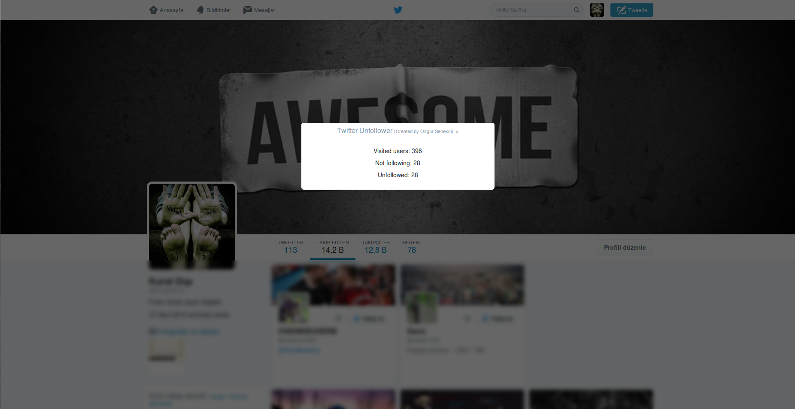

## Twitter Tools

#### Unfollower
Unfollower is a simple tool that allows you to unfollow all the users who don't follow you back. To use this tool, open the "following" tab in your Twitter profile. Press f12 to open developer tools. Open console tab, paste the code (that you copied from unfollow.js) and run it. After you run the code, it wil ask you how many times it should scroll the window (more scroll count = more users to visit). You will see the status on the screen while it is processing.

  

